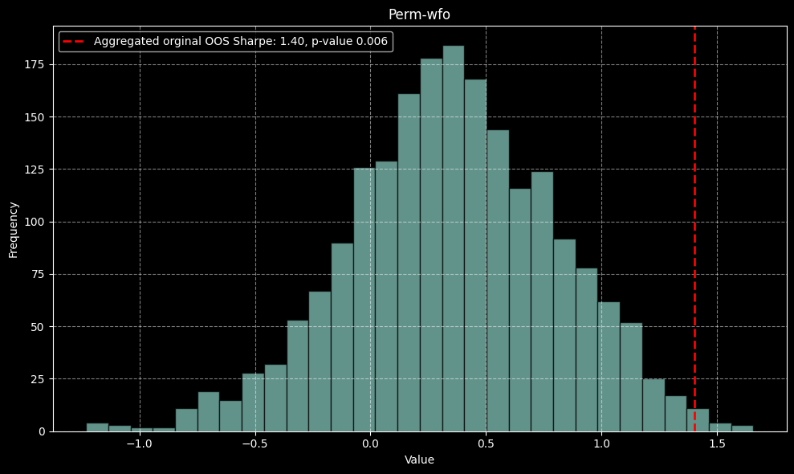
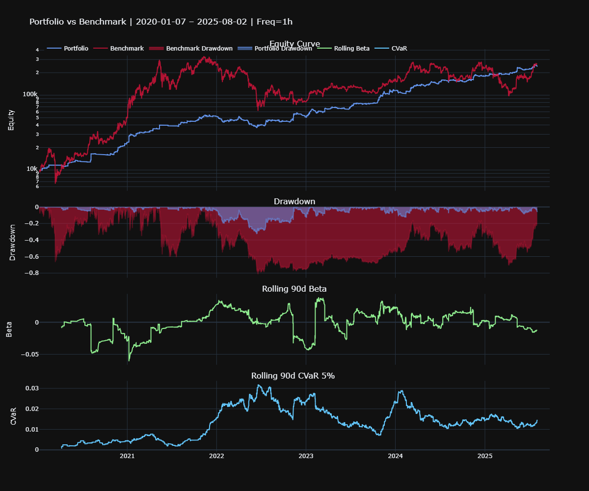

# QuantyBT 🪐

## This is a preview version, the framework itself is closed source yet. For full access, please reach out to me.

**A framework for quantitative backtesting and portfolio optimization. Focused on statistical robustness, modularity, and seamless integration of strategies, models, and crypto-native data loader. Combines the flexibility of Python with the performance of Rust to deliver fast and reliable backtests**

---

## License
[LICENSE](license.txt)

---

## Current Features

### Strategy Modules

- **Strategy**  
  Abstract base class for building custom trading strategies with modular signal and parameter structure.

- **Analyzer**    
  Simple Python-based backtester that leverages Rust for performance-critical loops. Outputs full performance metrics, equity curves, drawdown charts, and summary stats with minimal configuration.

- **AdvancedOptimizer**  
  The most comprehensive model in this project so far: a modified Walkforward Optimizer using **rolling** validation with precise control over training, testing, and warmup structure. 
  It uses **Bayesian Optimization** via [Hyperopt](https://github.com/hyperopt/hyperopt) instead of gridsearch for efficient hyperparameter search.   

  Key features:   
  – Clean **rolling walkforward split logic** with warmup gap  
  – A built-in **generalization loss penalty** to dynamically penalize overfit parameter sets  
  – Integrated **Monte Carlo bootstrapping** per out-of-sample fold for confidence intervals (Sharpe)  
  – WFO **permutation testing** to detect potential data mining bias in your evaluation process 
  
- **Bootstrapping**  
  Monte Carlo simulation engine for risk estimation and statistical robustness.  
  Outputs full distribution metrics and p-values for Sharpe, Sortino, Calmar, Max Drawdown, and more.

- **Permutation**  
  Second Monte Carlo simulation engine for detecting data mining bias

- **LocalSensitivityAnalyzer**  
  Uses simple perturbations to quickly screen for unstable or sensitive parameters.  

- **GlobalSensitivityAnalyzer**  
  Performs full grid search across 2D parameter space for global insight into strategy behavior.   

---

### Portfolio Modules

- **CorrelationAnalyzer**   
   Calculates asset dependency metrics, including:   
   - Linear and rank correlations (Pearson, Spearman, Kendall-Tau)  
   - Copula-based tail dependence (for modeling nonlinear extreme-risk co-movements)  

- **PortfolioAnalyzer**  
   Simulates portfolio performance using backtested trade records and state vectors. Key features:   
   - Supports weighting strategies (Equal Weight, Inverse Volatility, and custom models)   
   - Built-in sensitivity analysis via grid search and Monte Carlo simulations   


---

### Other

- **Loader**  
  Integrated crypto data loader using [CCXT](https://github.com/ccxt/ccxt).  
  Fetches and saves clean Binance historical data, no API key required.  
 
- **features**  
  file with useful functions for e.g. feature-engineering 

---

## Define your strategy

```python
import pandas as pd
import numpy as np
from quantybt import Strategy
from typing import Dict, Any
from hyperopt import hp

class YourStrategy(Strategy):
    def preprocess_data(self, df: pd.DataFrame, params: Dict[str, Any]) -> pd.DataFrame:
        """Data preprocessing and feature engineering"""
        # Ensure proper datetime index
        if not isinstance(df.index, pd.DatetimeIndex):
            df['timestamp'] = pd.to_datetime(df['timestamp'])
            df = df.set_index('timestamp')
        
        # Calculate indicators/features
        df['feature1'] = df['close'].rolling(params['feature1_window']).mean()
        df['feature2'] = df['high'].rolling(params['feature2_window']).max()
        df['trendfilter'] = df['close'] > df['close'].rolling(params['trendfilter_len']).mean()
        
        # Generate signals (avoid lookahead bias)
        df['entries'] = np.where(
            (df['feature1'] > params['feature1_thresh']) & 
            (df['feature2'] > params['feature2_thresh']) & 
            df['trendfilter'],
            1, 0
        ).shift(1)  # Critical: shift to prevent lookahead
        
        # Optional: exit signals
        df['exits'] = np.where(
            df['close'] < df['close'].rolling(params['exit_window']).mean(), 1, 0).shift(1)
        
        return df.dropna()

    def generate_signals(self, df: pd.DataFrame, **params) -> Dict[str, pd.Series]:
        """Extract signals from preprocessed data"""
        return {
            'entries': df['entries'].astype(bool),
            'exits': df['exits'].astype(bool),
            # Optional for short trades:
            # 'short_entries': df['short_entries'].astype(bool),
            # 'short_exits': df['short_exits'].astype(bool)
        }

    @property
    def param_space(self) -> Dict[str, Any]:
        """Hyperparameter optimization space"""
        return {
            "feature1_window": hp.choice("feature1_window", [20, 50, 100]),
            "feature1_thresh": hp.uniform("feature1_thresh", 0.9, 1.1),
            "feature2_window": hp.choice("feature2_window", [5, 10, 20]),
            "feature2_thresh": hp.uniform("feature2_thresh", 0.95, 1.05),
            "trendfilter_len": hp.choice("trendfilter_len", [100, 200, 300]),
            "exit_window": hp.choice("exit_window", [5, 10, 20])
        }

params = {"feature1_window": 100, "sl_pct": 0.10, ...}
df = pd.read_feather("path/to/BTC_1d.feather")
df['timestamp'] = pd.to_datetime(df['timestamp'])
df = df.set_index('timestamp')

strat = YourStrategy()

```

---

## Simple Backtesting

```python
from quantybt import Analyzer

analyzer = Analyzer(
    strategy   = strat,
    params     = params,
    full_data  = df,  
    timeframe  = '15m',
    initial_capital=1000,
    fixed_pos_size = None,            # -> 100% reinvest
    price_col  = 'close',   
    fees       = 0.0002,              # -> limit-order fees on bybit
    sl_stop    = params['sl_pct'])

print(analyzer.stats())

analyzer.plot_backtest()
```

```text

                              Value
CAGR Strategy [%]             92.16
CAGR Benchmark [%]            56.03
Total Return Strategy [%]   4046.74
Total Return Benchmark [%]  1164.54
Max Drawdown Strategy [%]    -21.94
Max Drawdown Benchmark [%]   -77.27
Volatility [%]                35.48
Sharpe                         2.02
Sortino                        2.91
Calmar                         4.20
Profit Factor                  2.54
Win Rate [%]                  41.67
Avg Win [%]                    5.48
Avg Loss [%]                  -1.54
Best Trade [%]                30.04
Worst Trade [%]               -8.96
Total Trades                 312.00
Max Consecutive Wins           7.00
Max Consecutive Losses         8.00
Full Kelly                     0.25
Correlation to Benchmark       0.53
Time in Market [%]            36.54


```


export your trade records:
```python
analyzer.export(directory=r"C:\Desktop\quantybt\records", name="01_BTC_1_records")
```
```
Trades exported to: C:\Desktop\quantybt\records\01_BTC_1_records_trades.feather
```

---
## Montecarlo Simulation - Bootstrapping

- **`analyzer`**: The already defined analyzer instance, as shown above
- **`n_sims`**: Total number of simulations. Aim for at least 5,000 simulations; 10,000 is recommended.
- **`batch_size`**: Controls how many simulations run per batch to manage memory usage

Note: standard bootstrapping methods destroy the autocorrelation structure of ur return series

```python
from quantybt.strategy.montecarlo import Bootstrapping

bt = Bootstrapping(analyzer, n_sims=10000, batch_size=1000)
btr = bt.run()
bt.plot(btr)

```
```text
=== Empirical P-Value Tests (Simulated vs Benchmark) ===

            Sharpe: p-value = 0.03960 | benchmark = 1.0074 | sim_mean = 1.8808
           Sortino: p-value = 0.04080 | benchmark = 1.4347 | sim_mean = 2.7117
            Calmar: p-value = 0.03820 | benchmark = 0.7370 | sim_mean = 2.6505
       MaxDrawdown: p-value = 0.00040 | benchmark = -0.772 | sim_mean = -0.3299       
```


---

## Strategy Optimization - AdvancedOptimizer

While most Puplic frameworks do not even support robust parameter optimization and if they do, then only simple train-test splits which are prone to overfitting, this framework offers a more advanced option when it comes to optimizing your parameters without overfitting your system.

Key components:

1. standard rolling-wfo engine
2. optional warmup between all folds
3. generalization loss penalty term
3. bootstrapping per oos fold for a empirical confidence interval of the sharpe-ratio
3. optional permutation test on aggregated oos-folds, which optimizes the parameters on each of the n-synthetic paths
and then compares them with the original sortino-ratio

```python
from quantybt.strategy.optimizer import AdvancedOptimizer, WFOSplitCfg, PlotWFOSummary

wfo = AdvancedOptimizer(
    analyzer         = analyzer,                # Instance of your Analyzer class
    max_warmup       = 700,                     # Number of warm-up candles between folds (prevents data leakage)
    timeframe        = '1h',                    # Timeframe for the Sharpe computation
    max_evals        = 500,                     # Number of parameter combinations tested during optimization
    target_metric    = 'Sharpe',                # Optimization target metric ('Sharpe', 'Sortino', etc.)
    beta             = 0.2,                     # Weighting factor for the generalization loss penalty
    split_cfgs       = WFOSplitCfg(
                          mode='rolling',
                          train_period='24ME',  # 24 months effective (resampled) training data
                          test_period='12ME'    # 12 months for out-of-sample validation
                      ),
    bootstrap_sims   = 3000,                    # Number of bootstrap simulations per OOS fold
    bootstrap_batch  = 1000,                    # Simulations per batch (memory/performance control)
    bootstrap_seed   = 69,                      # Seed for reproducibility
    verbose          = True                     # Enable verbose logging of fold-level results
)

best_params, trials = wfo.optimize()
results = wfo.evaluate()
print("Best Parameter:", best_params)

plotter = PlotWFOSummary(optimizer=wfo)
fig = plotter.plot("Walk-Forward Equity Curves")
fig.show()

```
It will output the backtest results for each IS- and OOS fold:

```text
100%|██████████| 500/500 [15:35<00:00,  3.62s/trial, best loss: -1.4039336492890995]

=== Fold 1 – In-Sample ===
                             Value
CAGR Strategy [%]           122.52
CAGR Benchmark [%]          141.59
Total Return Strategy [%]   338.85
Total Return Benchmark [%]  410.92
Max Drawdown Strategy [%]   -20.38
Max Drawdown Benchmark [%]  -54.92
Volatility [%]               42.17
Sharpe                        2.11
Sortino                       2.98
Calmar                        6.01
Profit Factor                 2.56
Win Rate [%]                 44.44
Avg Win [%]                   5.89
Avg Loss [%]                 -1.84
Best Trade [%]               27.98
Worst Trade [%]              -8.58
Total Trades                108.00
Max Consecutive Wins          4.00
Max Consecutive Losses        5.00
Full Kelly                    0.27
Correlation to Benchmark      0.54
Time in Market [%]           32.75

=== Fold 1 – Out-of-Sample ===
                            Value
CAGR Strategy [%]           18.45
CAGR Benchmark [%]         -40.28
Total Return Strategy [%]   18.17
Total Return Benchmark [%] -39.86
Max Drawdown Strategy [%]  -25.24
Max Drawdown Benchmark [%] -67.49
Volatility [%]              25.91
Sharpe                       0.78
Sortino                      1.11
Calmar                       0.73
Profit Factor                1.53
Win Rate [%]                28.57
Avg Win [%]                  5.58
Avg Loss [%]                -1.46
Best Trade [%]              25.04
Worst Trade [%]             -7.51
Total Trades                42.00
Max Consecutive Wins         1.00
Max Consecutive Losses       5.00
Full Kelly                   0.10
Correlation to Benchmark     0.43
Time in Market [%]          27.81

Bootstrap 95% CI (Sharpe): [-1.1803, 2.8621]

=== Fold 2 – In-Sample ===

...


```


The optional but strongly recommended permutation function:

```python
oos_returns = wfo.get_oos_returns()
orig_sharpe, p_val, dist = wfo.permutation_test(
    n_sims=2000,
    max_evals_per_perm=50,
    seed=123,
    n_jobs=-1
)

print(f"Original Sharpe: {orig_sharpe:.4f} | p-value: {p_val:.4f}")

```
```text
Original Sharpe: 1.4024 | p-value: 0.0060
```


---
## Portfolio Simulation - EqualWeightPortfolio

```python

from quantybt.portfolio import PortfolioAnalyzer
from quantybt.portfolio.sizing import InverseVolatility

trades = {
    'BTC1': r"C:\Users\quantybt\records\01_BTC_1_trades.feather",
    'ETH1': r"C:\Users\quantybt\records\02_ETH_1_trades.feather",
    'SOL1': r"C:\Users\quantybt\records\03_SOL_1_trades.feather",
}

states = {
    'BTC1': r"C:\Users\quantybt\records\01_BTC_1_statevector.feather",
    'ETH1': r"C:\Users\quantybt\records\02_ETH_1_statevector.feather",
    'SOL1': r"C:\Users\quantybt\records\03_SOL_1_statevector.feather",
}

    
pf = PortfolioAnalyzer(
        trade_paths=trades,
        statevector_paths=states,
        initial_capital=10_000,
        compounding=True,
        freq='4h', 
        start_date="2019-01-01",
        end_date="2026-01-01",
        logging_level="WARNING",  
    )
    
weights = InverseVolatility(window=6*90, normalize=True, target_leverage=1)
result_df = pf.run(portfolio=weights, leverage=1.0, rebalancing_cost_rate=0.0006)

pf.stats()
pf.plot(log_scale=True, beta_window=6*90, CVaR_window=6*90)

```
```text

Metric                 Portfolio    Benchmark
-------------------  -----------  -----------
Total Return %           2332.07      2530.82
CAGR %                     77.3         77.73
Annual Volatility %        27.98        81.86
Max Drawdown %             32.76        81.38
Ulcer Index                 7.94        45.76
Sharpe                      2.18         1.11
Sortino                     5.01         1.56

```


---
## Portfolio Simulation - CorrelationAnalyzer   

Use both trades- and statevector records as before to analyze your portfolio’s correlations and tail dependences.

```python

from quantybt.portfolio import CorrelationAnalyzer

ca = CorrelationAnalyzer(trades, states)
ca_results = ca.run(lookback_window=90)
 
ca.stats()
ca.plot()


```

```text

WARNING:__main__:May non-stationary: ETH2, ADF p=0.0000, KPSS p=0.0484

Pearson Correlation Matrix
|      |   BTC1 |   ETH1 |   SOL1 |   ETH2 |
|------|--------|--------|--------|--------|
| BTC1 |   1    |   0.29 |   0.1  |   0.33 |
| ETH1 |   0.29 |   1    |   0.09 |   0.77 |
| SOL1 |   0.1  |   0.09 |   1    |   0.13 |
| ETH2 |   0.33 |   0.77 |   0.13 |   1    |

Global Correlations
| Method   |   Correlation |
|----------|---------------|
| pearson  |          0.29 |
| spearman |          0.25 |
| kendall  |          0.22 |

Copula λ
| Copula Type   |   Mean λ |
|---------------|----------|
| Clayton λ     |     0.29 |
| Gumbel λ      |     0.45 |

```


---