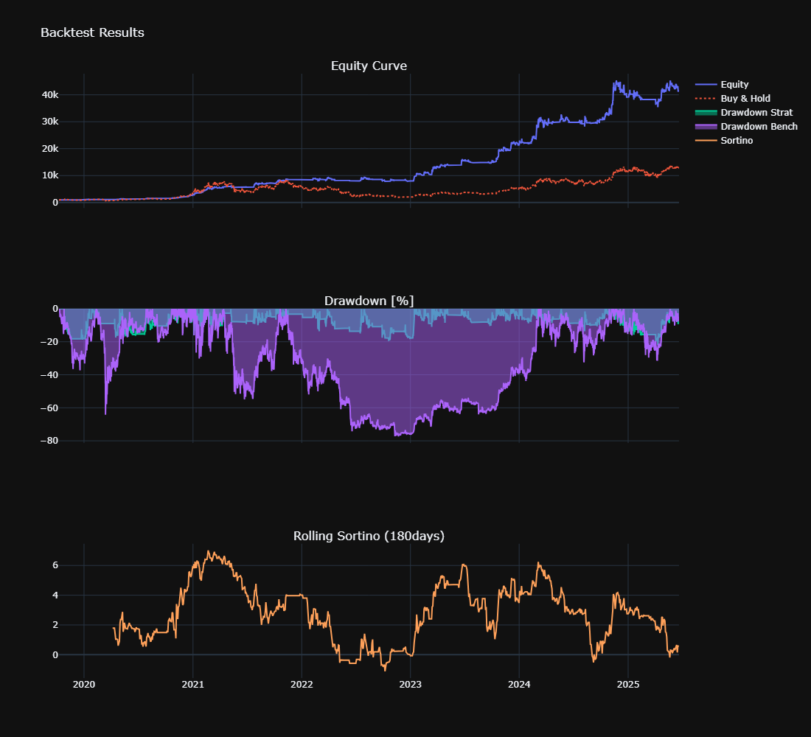

# QuantyBT 🪐

## For full access, please reach out to me so I can add you to the orginal repository.

**A framework for quantitative backtesting and portfolio optimization. Focused on statistical robustness, modularity, and seamless integration of strategies, models, and crypto-native data loader. Combines the flexibility of Python with the performance of Rust to deliver fast and reliable backtests**

---

## Current Features

### Strategy Modules

- **Strategy**  
  Abstract base class for building custom trading strategies with modular signal and parameter structure.

- **Analyzer**    
  Simple Python-based backtester that leverages Rust for performance-critical loops. Outputs full performance metrics, equity curves, drawdown charts, and summary stats with minimal configuration.

- **AdvancedOptimizer**  
  The most comprehensive model in this project so far: a modified Walkforward Optimizer using **rolling** validation with precise control over training, testing, and warmup structure. 
  It uses **Bayesian Optimization** via [Hyperopt](https://github.com/hyperopt/hyperopt) instead of gridsearch for efficient hyperparameter search.   

  Key features:   
  – Clean **rolling walkforward split logic** with warmup gap  
  – A built-in **generalization loss penalty** to dynamically penalize overfit parameter sets  
  – Integrated **Monte Carlo bootstrapping** per out-of-sample fold for confidence intervals (Sharpe)  
  – WFO **permutation testing** to detect potential data mining bias in your evaluation process 
  
- **Bootstrapping**  
  Monte Carlo simulation engine for risk estimation and statistical robustness.  
  Outputs full distribution metrics and p-values for Sharpe, Sortino, Calmar, Max Drawdown, and more.

- **Permutation**  
  Second Monte Carlo simulation engine for detecting data mining bias

- **LocalSensitivityAnalyzer**  
  Uses finite-difference-style perturbations to quickly screen for unstable or sensitive parameters.  

- **GlobalSensitivityAnalyzer**  
  Performs full grid search across 2D parameter space for global insight into strategy behavior.   

---

### Portfolio Modules

- **CorrelationAnalyzer**  
   Calculates Pearson, Spearman, Kendall-Tau and **Copula-Tail-Dependence** correlations.

- **EqualWeightPortfolio**  
   Naive 1/n allocation model for aggregated strategy returns, ideal for small portfolios < 5 strategies. 
   Computes **CVaR** on global, rolling and empirical (via Bootstrapping) basis

- **Hierarchical Risk Parity (Planned)**   
   allocation algorithm that clusters strategies based on statistical distance and recursively allocates risk to reduce overexposure to correlated groups

---

### Other

- **Loader**  
  Integrated crypto data loader using [CCXT](https://github.com/ccxt/ccxt).  
  Fetches and saves clean Binance historical data, no API key required.  
 
- **features**  
  file with useful functions for e.g. feature-engineering 


---

## License 
Copyright (c) 2025 [Niklas Schlütter / papaya0712]     

All rights reserved

---

## Define ur strategy

```python
import pandas as pd
import numpy as np
from quantybt import Strategy
from typing import Dict, Any
from hyperopt import hp

class YourStrategy(Strategy):
    def preprocess_data(self, df: pd.DataFrame, params: Dict[str, Any]) -> pd.DataFrame:
        """Data preprocessing and feature engineering"""
        # Ensure proper datetime index
        if not isinstance(df.index, pd.DatetimeIndex):
            df['timestamp'] = pd.to_datetime(df['timestamp'])
            df = df.set_index('timestamp')
        
        # Calculate indicators/features
        df['feature1'] = df['close'].rolling(params['feature1_window']).mean()
        df['feature2'] = df['high'].rolling(params['feature2_window']).max()
        df['trendfilter'] = df['close'] > df['close'].rolling(params['trendfilter_len']).mean()
        
        # Generate signals (avoid lookahead bias)
        df['entries'] = np.where(
            (df['feature1'] > params['feature1_thresh']) & 
            (df['feature2'] > params['feature2_thresh']) & 
            df['trendfilter'],
            1, 0
        ).shift(1)  # Critical: shift to prevent lookahead
        
        # Optional: exit signals
        df['exits'] = np.where(
            df['close'] < df['close'].rolling(params['exit_window']).mean(), 1, 0).shift(1)
        
        return df.dropna()

    def generate_signals(self, df: pd.DataFrame, **params) -> Dict[str, pd.Series]:
        """Extract signals from preprocessed data"""
        return {
            'entries': df['entries'].astype(bool),
            'exits': df['exits'].astype(bool),
            # Optional for short trades:
            # 'short_entries': df['short_entries'].astype(bool),
            # 'short_exits': df['short_exits'].astype(bool)
        }

    @property
    def param_space(self) -> Dict[str, Any]:
        """Hyperparameter optimization space"""
        return {
            "feature1_window": hp.choice("feature1_window", [20, 50, 100]),
            "feature1_thresh": hp.uniform("feature1_thresh", 0.9, 1.1),
            "feature2_window": hp.choice("feature2_window", [5, 10, 20]),
            "feature2_thresh": hp.uniform("feature2_thresh", 0.95, 1.05),
            "trendfilter_len": hp.choice("trendfilter_len", [100, 200, 300]),
            "exit_window": hp.choice("exit_window", [5, 10, 20])
        }

params = {"feature1_window": 100, "sl_pct": 0.10, ...}
df = pd.read_feather("path/to/BTC_1d.feather")
df['timestamp'] = pd.to_datetime(df['timestamp'])
df = df.set_index('timestamp')

strat = YourStrategy()

```

---

## Simple Backtesting

```python
from quantybt import Analyzer

analyzer = Analyzer(
    strategy   = strat,
    params     = params,
    full_data  = df,  
    timeframe  = '15m',
    initial_capital=1000,
    price_col  = 'close',   
    fees       = 0.0002,
    sl_stop    = params['sl_pct'])

print(analyzer.stats())

analyzer.plot_backtest()
```

```text

                              Value
CAGR Strategy [%]             92.16
CAGR Benchmark [%]            56.03
Total Return Strategy [%]   4046.74
Total Return Benchmark [%]  1164.54
Max Drawdown Strategy [%]    -21.94
Max Drawdown Benchmark [%]   -77.27
Volatility [%]                35.48
Sharpe                         2.02
Sortino                        2.91
Calmar                         4.20
Profit Factor                  2.54
Win Rate [%]                  41.67
Avg Win [%]                    5.48
Avg Loss [%]                  -1.54
Best Trade [%]                30.04
Worst Trade [%]               -8.96
Total Trades                 312.00
Max Consecutive Wins           7.00
Max Consecutive Losses         8.00
Full Kelly                     0.25
Correlation to Benchmark       0.53
Time in Market [%]            36.54


```


export your trade records:
```python
analyzer.export(directory=r"C:\Desktop\quantybt\records", name="01_BTC_1_records")
```
```
Trades exported to: C:\Desktop\quantybt\records\01_BTC_1_records_trades.feather
```
---


## Montecarlo Simulation - Bootstrapping

- **`analyzer`**: The already defined analyzer instance, as shown above
- **`n_sims`**: Total number of simulations. Aim for at least 5,000 simulations; 10,000 is recommended.
- **`batch_size`**: Controls how many simulations run per batch to manage memory usage

Note: standard bootstrapping methods destroy the autocorrelation structure of ur return series

```python
from quantybt.strategy.montecarlo import Bootstrapping

bt = Bootstrapping(analyzer, n_sims=10000, batch_size=1000)
btr = bt.run()
bt.plot(btr)

```
```text
=== Empirical P-Value Tests (Simulated vs Benchmark) ===

            Sharpe: p-value = 0.03960 | benchmark = 1.0074 | sim_mean = 1.8808
           Sortino: p-value = 0.04080 | benchmark = 1.4347 | sim_mean = 2.7117
            Calmar: p-value = 0.03820 | benchmark = 0.7370 | sim_mean = 2.6505
       MaxDrawdown: p-value = 0.00040 | benchmark = -0.772 | sim_mean = -0.3299       
```


## Montecarlo Simulation - Permutation

- **`analyzer`**: The already defined analyzer instance, as shown above.
- **`n_sims`**: Total number of simulations. Due to much higher computational costs aim for at least 500 simulations

The smaller the p-value, the less likely it is that the strategy’s performance is due to chance. The null hypothesis states: "The strategy has no genuine edge, its performance could be replicated on a randomly permuted price series"

```python
from quantybt.strategy.montecarlo import Permutation

pt = Permutation(analyzer, n_sims=500)
ptr = pt.run()
pt.plot(ptr)
```
```text
Running Permutation Test…
Permutations done: 100%|██████████| 250/250 [12:57<00:00,  3.11s/it]

Sharpe p-value: 0.0040
Sortino p-value: 0.0040
```


## Portfolio Simulation - CorrelationAnalyzer   

Use the .export_trades() function from your defined `Analyzer` classes, along with their corresponding benchmark time series, to analyze your portfolio’s correlations and tail risks.

Note: The CorrelationAnalyzer plots arithmetic equity curves (i.e. without compounding effects), which do not affect the computed correlations.

```python

from quantybt.portfolio.correlation import CorrelationAnalyzer

trade_sources = {
    'BTC_01': {
        'trades': r'C:\Desktop\quantybt\records\01_BTC_1_records_trades.feather',
        'df': r'C:\Desktop\quantybt\data\BTCUSDT_15m.feather'
    },
    'ETH_02': {
        'trades': r'C:\Desktop\quantybt\records\03_ETH_1_records_trades.feather',
        'df': r'C:\Desktop\quantybt\data\ETHUSDT_15m.feather'
    },
    'SOL_03': {
        'trades': r'C:\Desktop\quantybt\records\04_SOL_1_records_trades.feather',
        'df': r'C:\Desktop\quantybt\data\SOLUSDT_1h.feather'
    }
}

sca = CorrelationAnalyzer(trade_sources=trade_sources)
results_sca = sca.run()
print(results_sca["pearson_corr_active"])


```
```text
Loaded 3 strategies: ['BTC_01', 'ETH_02', 'SOL_03']
          
        BTC_01  ETH_03  SOL_04
BTC_01    1.00    0.08    0.00
ETH_03    0.08    1.00    0.04
SOL_04    0.00    0.04    1.00

```

