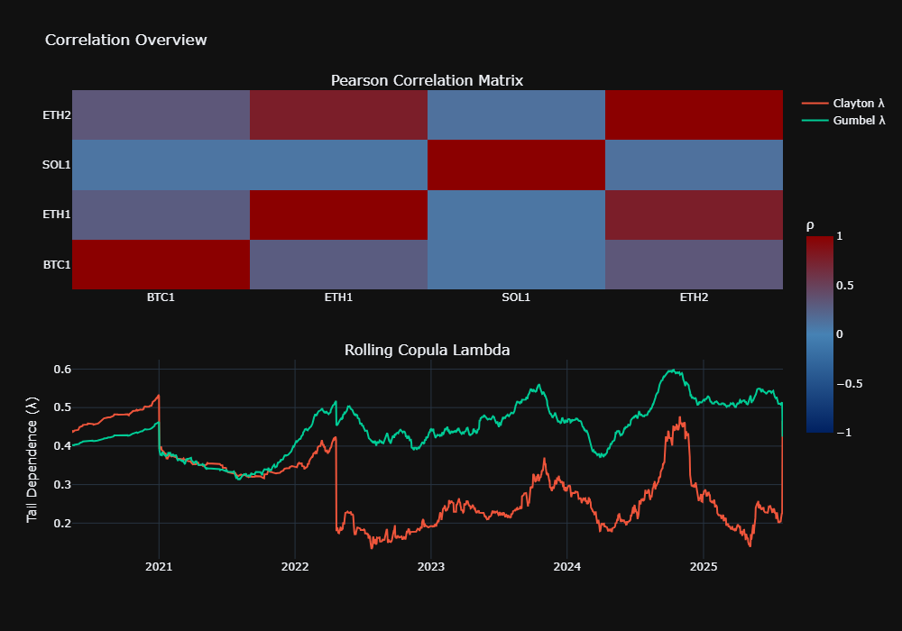
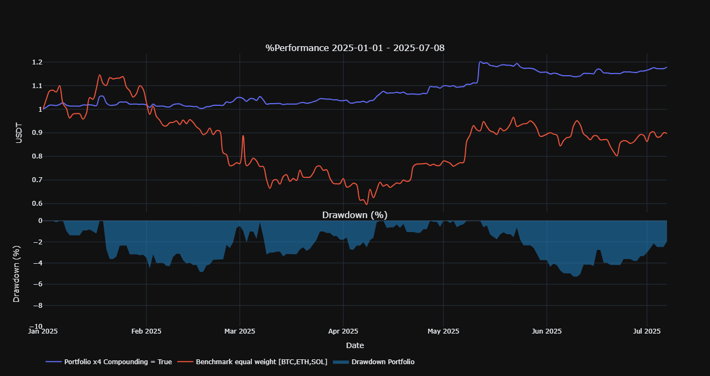

# QuantyBT 🪐

## This is a preview version. For full access, please reach out to me so I can add you to the orginal repository.

**A framework for quantitative backtesting and portfolio optimization. Focused on statistical robustness, modularity, and seamless integration of strategies, models, and crypto-native data loader. Combines the flexibility of Python with the performance of Rust to deliver fast and reliable backtests**

---

## Current Features

### Strategy Modules

- **Strategy**  
  Abstract base class for building custom trading strategies with modular signal and parameter structure.

- **Analyzer**    
  Simple Python-based backtester that leverages Rust for performance-critical loops. Outputs full performance metrics, equity curves, drawdown charts, and summary stats with minimal configuration.

- **AdvancedOptimizer**  
  The most comprehensive model in this project so far: a modified Walkforward Optimizer using **rolling** validation with precise control over training, testing, and warmup structure. 
  It uses **Bayesian Optimization** via [Hyperopt](https://github.com/hyperopt/hyperopt) instead of gridsearch for efficient hyperparameter search.   

  Key features:   
  – Clean **rolling walkforward split logic** with warmup gap  
  – A built-in **generalization loss penalty** to dynamically penalize overfit parameter sets  
  – Integrated **Monte Carlo bootstrapping** per out-of-sample fold for confidence intervals (Sharpe)  
  – WFO **permutation testing** to detect potential data mining bias in your evaluation process 
  
- **Bootstrapping**  
  Monte Carlo simulation engine for risk estimation and statistical robustness.  
  Outputs full distribution metrics and p-values for Sharpe, Sortino, Calmar, Max Drawdown, and more.

- **Permutation**  
  Second Monte Carlo simulation engine for detecting data mining bias

- **LocalSensitivityAnalyzer**  
  Uses finite-difference-style perturbations to quickly screen for unstable or sensitive parameters.  

- **GlobalSensitivityAnalyzer**  
  Performs full grid search across 2D parameter space for global insight into strategy behavior.   

---

### Portfolio Modules

- **CorrelationAnalyzer**  
   Calculates Pearson, Spearman, Kendall-Tau and **Copula-Tail-Dependence** correlations.

- **EqualWeightPortfolio**  
   Naive 1/n allocation model for aggregated strategy returns, ideal for small portfolios < 5 strategies. 
   Computes **CVaR** on global, rolling and empirical (via Bootstrapping) basis

- **Hierarchical Risk Parity (Planned)**   
   allocation algorithm that clusters strategies based on statistical distance and recursively allocates risk to reduce overexposure to correlated groups

---

### Other

- **Loader**  
  Integrated crypto data loader using [CCXT](https://github.com/ccxt/ccxt).  
  Fetches and saves clean Binance historical data, no API key required.  
 
- **features**  
  file with useful functions for e.g. feature-engineering 


---

## License 
Copyright (c) 2025 [Niklas Schlütter / papaya0712]     

All rights reserved

---

## Define ur strategy

```python
import pandas as pd
import numpy as np
from quantybt import Strategy
from typing import Dict, Any
from hyperopt import hp

class YourStrategy(Strategy):
    def preprocess_data(self, df: pd.DataFrame, params: Dict[str, Any]) -> pd.DataFrame:
        """Data preprocessing and feature engineering"""
        # Ensure proper datetime index
        if not isinstance(df.index, pd.DatetimeIndex):
            df['timestamp'] = pd.to_datetime(df['timestamp'])
            df = df.set_index('timestamp')
        
        # Calculate indicators/features
        df['feature1'] = df['close'].rolling(params['feature1_window']).mean()
        df['feature2'] = df['high'].rolling(params['feature2_window']).max()
        df['trendfilter'] = df['close'] > df['close'].rolling(params['trendfilter_len']).mean()
        
        # Generate signals (avoid lookahead bias)
        df['entries'] = np.where(
            (df['feature1'] > params['feature1_thresh']) & 
            (df['feature2'] > params['feature2_thresh']) & 
            df['trendfilter'],
            1, 0
        ).shift(1)  # Critical: shift to prevent lookahead
        
        # Optional: exit signals
        df['exits'] = np.where(
            df['close'] < df['close'].rolling(params['exit_window']).mean(), 1, 0).shift(1)
        
        return df.dropna()

    def generate_signals(self, df: pd.DataFrame, **params) -> Dict[str, pd.Series]:
        """Extract signals from preprocessed data"""
        return {
            'entries': df['entries'].astype(bool),
            'exits': df['exits'].astype(bool),
            # Optional for short trades:
            # 'short_entries': df['short_entries'].astype(bool),
            # 'short_exits': df['short_exits'].astype(bool)
        }

    @property
    def param_space(self) -> Dict[str, Any]:
        """Hyperparameter optimization space"""
        return {
            "feature1_window": hp.choice("feature1_window", [20, 50, 100]),
            "feature1_thresh": hp.uniform("feature1_thresh", 0.9, 1.1),
            "feature2_window": hp.choice("feature2_window", [5, 10, 20]),
            "feature2_thresh": hp.uniform("feature2_thresh", 0.95, 1.05),
            "trendfilter_len": hp.choice("trendfilter_len", [100, 200, 300]),
            "exit_window": hp.choice("exit_window", [5, 10, 20])
        }

params = {"feature1_window": 100, "sl_pct": 0.10, ...}
df = pd.read_feather("path/to/BTC_1d.feather")
df['timestamp'] = pd.to_datetime(df['timestamp'])
df = df.set_index('timestamp')

strat = YourStrategy()

```

---

## Simple Backtesting

```python
from quantybt import Analyzer

analyzer = Analyzer(
    strategy   = strat,
    params     = params,
    full_data  = df,  
    timeframe  = '15m',
    initial_capital=1000,
    price_col  = 'close',   
    fees       = 0.0002,
    sl_stop    = params['sl_pct'])

print(analyzer.stats())

analyzer.plot_backtest()
```

```text

                              Value
CAGR Strategy [%]             92.16
CAGR Benchmark [%]            56.03
Total Return Strategy [%]   4046.74
Total Return Benchmark [%]  1164.54
Max Drawdown Strategy [%]    -21.94
Max Drawdown Benchmark [%]   -77.27
Volatility [%]                35.48
Sharpe                         2.02
Sortino                        2.91
Calmar                         4.20
Profit Factor                  2.54
Win Rate [%]                  41.67
Avg Win [%]                    5.48
Avg Loss [%]                  -1.54
Best Trade [%]                30.04
Worst Trade [%]               -8.96
Total Trades                 312.00
Max Consecutive Wins           7.00
Max Consecutive Losses         8.00
Full Kelly                     0.25
Correlation to Benchmark       0.53
Time in Market [%]            36.54


```


export your trade records:
```python
analyzer.export(directory=r"C:\Desktop\quantybt\records", name="01_BTC_1_records")
```
```
Trades exported to: C:\Desktop\quantybt\records\01_BTC_1_records_trades.feather
```

---
## Montecarlo Simulation - Bootstrapping

- **`analyzer`**: The already defined analyzer instance, as shown above
- **`n_sims`**: Total number of simulations. Aim for at least 5,000 simulations; 10,000 is recommended.
- **`batch_size`**: Controls how many simulations run per batch to manage memory usage

Note: standard bootstrapping methods destroy the autocorrelation structure of ur return series

```python
from quantybt.strategy.montecarlo import Bootstrapping

bt = Bootstrapping(analyzer, n_sims=10000, batch_size=1000)
btr = bt.run()
bt.plot(btr)

```
```text
=== Empirical P-Value Tests (Simulated vs Benchmark) ===

            Sharpe: p-value = 0.03960 | benchmark = 1.0074 | sim_mean = 1.8808
           Sortino: p-value = 0.04080 | benchmark = 1.4347 | sim_mean = 2.7117
            Calmar: p-value = 0.03820 | benchmark = 0.7370 | sim_mean = 2.6505
       MaxDrawdown: p-value = 0.00040 | benchmark = -0.772 | sim_mean = -0.3299       
```


---
## Montecarlo Simulation - Permutation

- **`analyzer`**: The already defined analyzer instance, as shown above.
- **`n_sims`**: Total number of simulations. Due to much higher computational costs aim for at least 500 simulations

The smaller the p-value, the less likely it is that the strategy’s performance is due to chance. The null hypothesis states: "The strategy has no genuine edge, its performance could be replicated on a randomly permuted price series"

```python
from quantybt.strategy.montecarlo import Permutation

pt = Permutation(analyzer, n_sims=500)
ptr = pt.run()
pt.plot(ptr)
```
```text
Running Permutation Test…
Permutations done: 100%|██████████| 250/250 [12:57<00:00,  3.11s/it]

Sharpe p-value: 0.0040
Sortino p-value: 0.0040
```


---
## Strategy Optimization - AdvancedOptimizer

While most Puplic frameworks do not even support robust parameter optimization and if they do, then only simple train-test splits which are prone to overfitting, this framework offers a more advanced option when it comes to optimizing your parameters without overfitting your system.

Key components:

1. standard rolling-wfo engine
2. optional warmup between all folds
3. generalization loss penalty term
3. bootstrapping per oos fold for a empirical confidence interval of the sharpe-ratio
3. optional permutation test on aggregated oos-folds, which optimizes the parameters on each of the n-synthetic paths
and then compares them with the original sortino-ratio

```python
from quantybt.strategy.optimizer import AdvancedOptimizer, WFOSplitCfg, PlotWFOSummary

wfo = AdvancedOptimizer(
    analyzer         = analyzer,                # Instance of your Analyzer class
    max_warmup       = 700,                     # Number of warm-up candles between folds (prevents data leakage)
    timeframe        = '1h',                    # Timeframe for the Sharpe computation
    max_evals        = 500,                     # Number of parameter combinations tested during optimization
    target_metric    = 'Sharpe',                # Optimization target metric ('Sharpe', 'Sortino', etc.)
    beta             = 0.2,                     # Weighting factor for the generalization loss penalty
    split_cfgs       = WFOSplitCfg(
                          mode='rolling',
                          train_period='24ME',  # 24 months effective (resampled) training data
                          test_period='12ME'    # 12 months for out-of-sample validation
                      ),
    bootstrap_sims   = 3000,                    # Number of bootstrap simulations per OOS fold
    bootstrap_batch  = 1000,                    # Simulations per batch (memory/performance control)
    bootstrap_seed   = 69,                      # Seed for reproducibility
    verbose          = True                     # Enable verbose logging of fold-level results
)


best_params, trials = wfo.optimize()
results = wfo.evaluate()
print("Best Parameter:", best_params)

plotter = PlotWFOSummary(optimizer=wfo)
fig = plotter.plot("Walk-Forward Equity Curves")
fig.show()

```
It will output the backtest results for each IS- and OOS fold:

```text
100%|██████████| 500/500 [15:35<00:00,  3.62s/trial, best loss: -1.4039336492890995]

=== Fold 1 – In-Sample ===
                             Value
CAGR Strategy [%]           122.52
CAGR Benchmark [%]          141.59
Total Return Strategy [%]   338.85
Total Return Benchmark [%]  410.92
Max Drawdown Strategy [%]   -20.38
Max Drawdown Benchmark [%]  -54.92
Volatility [%]               42.17
Sharpe                        2.11
Sortino                       2.98
Calmar                        6.01
Profit Factor                 2.56
Win Rate [%]                 44.44
Avg Win [%]                   5.89
Avg Loss [%]                 -1.84
Best Trade [%]               27.98
Worst Trade [%]              -8.58
Total Trades                108.00
Max Consecutive Wins          4.00
Max Consecutive Losses        5.00
Full Kelly                    0.27
Correlation to Benchmark      0.54
Time in Market [%]           32.75

=== Fold 1 – Out-of-Sample ===
                            Value
CAGR Strategy [%]           18.45
CAGR Benchmark [%]         -40.28
Total Return Strategy [%]   18.17
Total Return Benchmark [%] -39.86
Max Drawdown Strategy [%]  -25.24
Max Drawdown Benchmark [%] -67.49
Volatility [%]              25.91
Sharpe                       0.78
Sortino                      1.11
Calmar                       0.73
Profit Factor                1.53
Win Rate [%]                28.57
Avg Win [%]                  5.58
Avg Loss [%]                -1.46
Best Trade [%]              25.04
Worst Trade [%]             -7.51
Total Trades                42.00
Max Consecutive Wins         1.00
Max Consecutive Losses       5.00
Full Kelly                   0.10
Correlation to Benchmark     0.43
Time in Market [%]          27.81

Bootstrap 95% CI (Sharpe): [-1.1803, 2.8621]

=== Fold 2 – In-Sample ===

...


```


The optional but strongly recommended permutation function:

```python
oos_returns = wfo.get_oos_returns()
orig_sharpe, p_val, dist = wfo.permutation_test(
    n_sims=500,
    max_evals_per_perm=50,
    seed=123,
    n_jobs=-1
    )

print(f"Original Sharpe: {orig_sharpe:.4f} | p-value: {p_val:.4f}")

```
```text
Original Sharpe: 1.6043 | p-value: 0.0100
```

---
## Portfolio Simulation - CorrelationAnalyzer   

Use the .export_trades() function from your defined `Analyzer` classes, along with their corresponding benchmark time series, to analyze your portfolio’s correlations and tail risks.

Note: The CorrelationAnalyzer plots arithmetic equity curves (i.e. without compounding effects), which do not affect the computed correlations.

```python

from quantybt.portfolio.correlation import CorrelationAnalyzer

trade_sources = {
    'BTC_01': {
        'trades': r'C:\Desktop\quantybt\records\01_BTC_1_records_trades.feather',
        'df': r'C:\Desktop\quantybt\data\BTCUSDT_15m.feather'
    },
    'ETH_02': {
        'trades': r'C:\Desktop\quantybt\records\03_ETH_1_records_trades.feather',
        'df': r'C:\Desktop\quantybt\data\ETHUSDT_15m.feather'
    },
    'SOL_03': {
        'trades': r'C:\Desktop\quantybt\records\04_SOL_1_records_trades.feather',
        'df': r'C:\Desktop\quantybt\data\SOLUSDT_1h.feather'
    }
}

sca = CorrelationAnalyzer(trade_sources=trade_sources)
results_sca = sca.run()
print(results_sca["pearson_corr_active"])


```

```text
Loaded 3 strategies: ['BTC_01', 'ETH_02', 'SOL_03']
          
        BTC_01  ETH_03  SOL_04
BTC_01    1.00    0.08    0.00
ETH_03    0.08    1.00    0.04
SOL_04    0.00    0.04    1.00

```



---
## Portfolio Simulation - EqualWeightPortfolio

```python
ewp = EqualWeightedPortfolio(trade_sources=trade_sources,
                             compounding=False, 
                             benchmark_path=r"C:\Desktop\quantybt\data\BTCUSDT_1d.feather",
                             benchmark_compounding=True,
                             )

results_ewp = ewp.run(freq='1d')
print(results_ewp)
ewp.plot()

```
```text
                         Value
total_return_pct        544.34
AnnualizedReturn_pct     96.47
max_drawdown_pct          6.24
Sharpe                    2.86
Sortino                   4.11
Calmar                    6.26
CVaR_95_pct               2.49
```


These results highlight key patterns in the portfolio’s behavior:

1. Rapid portfolio growth during the 2020–2021 bull market.
2. Two distinct short-term drawdown spikes:  
   – April 2020 (COVID-19 crash)  
   – June 2022 (Terra-Luna collapse)

Both events are explainable in the context of broader market disruptions.  
In April 2020, Bitcoin dropped nearly 50% within days due to the global COVID-19 shock.  
In June 2022, the collapse of the Terra-Luna ecosystem triggered widespread deleveraging and panic across the crypto market.

Despite these events, the portfolio recovered rapidly, underlining its resilience and structural robustness.

But what if the portfolio’s strong overall performance is mainly driven by early gains in 2020–2021?

To test this, we remove those outlier years. After all, no one wants to rely on a strategy that only performed well in a single historic bull market.

To evaluate year-over-year robustness, we use the `.run_by_year()` function provided by `EqualWeightedPortfolio`. This method calculates annual metrics—such as return, max drawdown, and Sortino ratio—for each calendar year and compares them to our benchmark asset.

This allows us to assess whether the strategy delivers consistent, risk-adjusted performance over time or if results are concentrated in just a few exceptional periods.


```python
df_yearly = ewp.run_by_year(freq='1d', remove_years=[])  
print(df_yearly)

```

```text
                          2019    2020    2021    2022    2023    2024   2025    AVG
portfolio_return_pct     -2.70  107.18  115.09    1.81   22.67    9.12   4.34  36.79
portfolio_max_dd_pct      2.84    6.24    3.38    5.94    2.02    1.46   1.30   3.31
portfolio_sortino        -0.08    4.11    7.64    0.36    5.16    3.01   3.12   3.33
benchmark_return_pct    -23.64  302.24   57.52  -65.33  154.75  111.50   8.55  77.94
benchmark_max_dd_pct     29.70   54.00   53.22   66.94   20.01   26.26  28.10  39.75
benchmark_sortino        -2.78    2.05    1.03   -1.24    2.91    1.93   0.69   0.66

```
after removing:
```text

                          2019   2022   2023   2024   2025    AVG
portfolio_return_pct     -2.70   1.81  22.67   9.12   4.34   7.05
portfolio_max_dd_pct      2.84   5.94   2.02   1.46   1.30   2.71
portfolio_sortino        -0.08   0.36   5.16   3.01   3.12   2.31
benchmark_return_pct    -23.64 -65.33 154.75 111.50   8.55  37.17
benchmark_max_dd_pct     29.70  66.94  20.01  26.26  28.10  34.20
benchmark_sortino        -2.78  -1.24   2.91   1.93   0.69   0.30
```

After excluding the extreme bull market years 2020 and 2021, we obtain a more realistic picture of portfolio performance under typical market conditions:

- **Annualized Return:** ~7.05%  
- **Max Drawdown:** ~2.7%  
- **Sortino Ratio:** ~2.3

In comparison, Bitcoin's historical annual return ranges from ~37% to 70%, but this comes with an average max drawdown between 35% and 40%. Our portfolio exhibits significantly lower downside risk, achieving similar or superior risk-adjusted returns.

This implies a much higher efficiency per unit of risk taken. While absolute returns may appear lower, the drawdown profile allows for the use of **moderate leverage** without exposing the portfolio to the extreme tail risks typical for unhedged crypto holdings.

Assuming linear growth and no compounding, both return and drawdown scale proportionally with leverage, enabling controlled amplification of performance under risk-aware constraints.

---
## Live Update

As mentioned above, for this portfolio (when not compounding), leverage is recommended (and used) to avoid underperformance relative to a simple buy-and-hold approach using ETFs.

### 📈 Portfolio Performance

| Metric                  | Portfolio (5x lev) |  Benchmark (Equal-Weighted) |
|-------------------------|--------------------|-----------------------------|
| Return                  | **22.15 %**        | -11.86 %                    |
| Max Drawdown (relative) | **5.18 %**         | 48.01 %                     |
| Sortino Ratio           | **5.52**           | -0.08                       |

The benchmark is an equal-weighted (1/3 each) buy-and-hold portfolio of BTC, ETH, and SOL (i.e. all traded assets) 



> **Note:** A portion of the performance includes trades from the final out-of-sample fold prior to live deployment.  
> Signals and execution logic are identical to live trading.  
> Average observed slippage is ~0.0027 % per trade 

Live signals execute exactly as in backtest, with no observed drift or divergence so far.

---
Thanks for reading
---